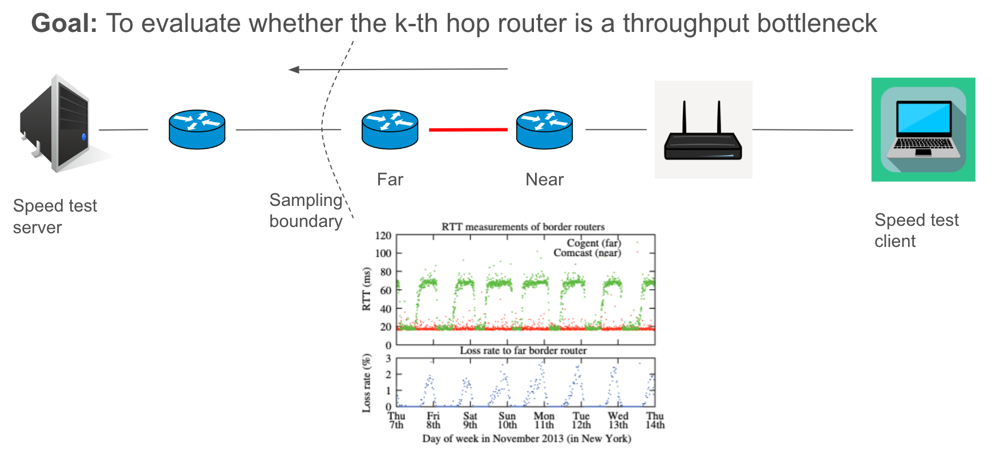
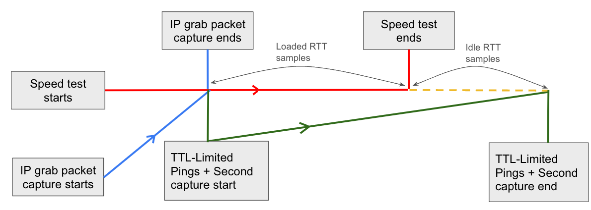

# Bottleneck Link Locator in Access networks





## Prerequisites

- Linux (*Windows and MacOS are untested*)
- [libpcap](https://github.com/the-tcpdump-group/libpcap) library
- [ndt7-client](https://github.com/m-lab/ndt7-client-go) or [ookla](https://www.speedtest.net/apps/cli) speedtest client
- [tshark](https://tshark.dev/setup/install/) (optional)

[Download Binary](https://github.com/internet-equity/traceneck/releases/latest) |
[Docker Image](https://github.com/internet-equity/traceneck/pkgs/container/traceneck)

## Build from Source

Install [go](https://go.dev/dl/), [make](https://www.gnu.org/software/make/) (recommended) and run

```sh
make build # OR make release
make setcap
./bin/traceneck
```

OR use [docker](https://docs.docker.com/engine/install/)

```sh
make docker
docker run --rm -v ./data:/data traceneck:latest
```

## Build for Netrics

```sh
export NETRICS=true
make build # OR make release
make setcap
./bin/netrics-traceneck
```

OR use [docker](https://docs.docker.com/engine/install/)

```sh
export NETRICS=true
make docker
docker run --rm traceneck:netrics
```

## Options

```sh
Usage: traceneck [OPTIONS]

Options:
  -I, --interface string   Interface (default "enp2s0")
  -t, --tool string        Speedtest tool to use: ndt or ookla (default "ndt")
  -p, --ping-type string   Ping packet type: icmp or udp (default "icmp")
  -m, --max-ttl int        Maximum TTL until which to send pings (default 5)
  -d, --direct int         Hop to ping directly by icmp echo [0 to skip] (default 1)
  -o, --out-dir string     Output directory (default "data")
  -T, --tshark             Use TShark
  -i, --idle int           Post speedtest idle time (in secs) (default 10)
  -a, --archive            Create output archive
  -h, --help               Show this help
  -v, --version            Show version
```
